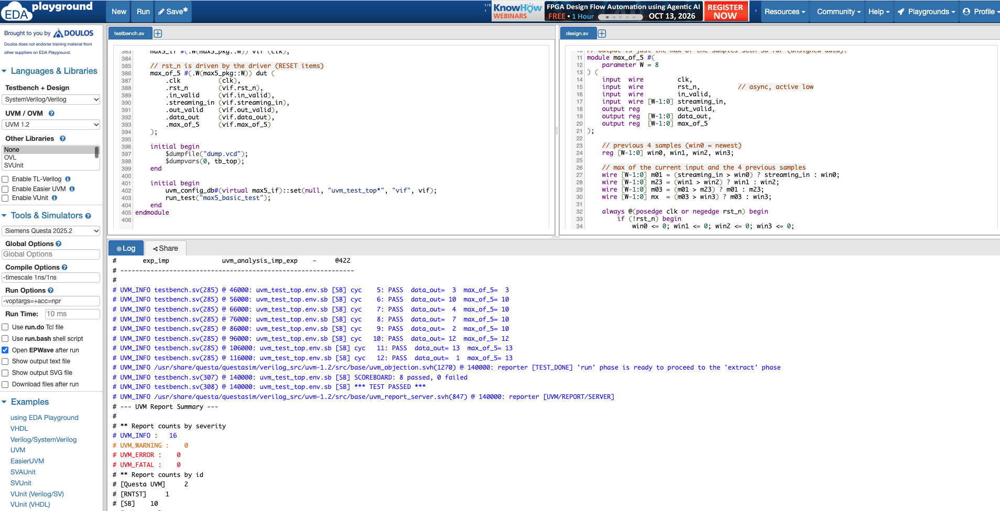

# max_of_5 — Streaming Max-of-5 with a UVM Testbench

A small streaming block that outputs the maximum of the last 5 input samples, verified with a SystemVerilog UVM testbench.

```
in      : 3  10   4   7   2  12  13   1
max_of_5: 3  10  10  10  10  12  13  13
```

## Layout
```
rtl/
  max_of_5.v              DUT
tb/
  max5_pkg.sv             package (includes all classes)
  agent/                  item, sequencer, driver, monitor, agent
  seq/                    max5_basic_seq (reset, spec table, drain)
  env/                    predictor (reference model), scoreboard, env
  tests/                  max5_basic_test
  top/                    interface, tb_top
sim/
  files.f                 compile list
  Makefile                questa / vcs / xrun targets
docs/
  TEST_PLAN.md            full plan (87 items)
  TEST_LIST.md            20-test list (directed + constrained random)
  images/                 simulation screenshots
edaplayground/
  testbench.sv            all tb/ files merged into one (for EDA Playground)
  design.sv               copy of rtl/max_of_5.v
```

## Results

`max5_basic_test` passes on **Siemens Questa 2025.2** (UVM 1.2, EDA Playground): 8 scoreboard checks passed, 0 failed, 0 `UVM_ERROR` / `UVM_FATAL`.



## Testbench architecture
```
tb_top ── max5_if ── max_of_5 (DUT)
  └─ max5_basic_test
       └─ max5_env
            ├─ max5_agent
            │    ├─ max5_sequencer
            │    ├─ max5_driver
            │    └─ max5_monitor ──in_ap──> max5_predictor ──> max5_scoreboard
            │                    ──out_ap──────────────────────> max5_scoreboard
```

## Run
Requires a simulator with UVM (Questa, VCS or Xcelium).
```
cd sim
make questa      # or: make vcs / make xrun
```
Expected end of log:
```
UVM_INFO ... [SB] SCOREBOARD: 8 passed, 0 failed
UVM_INFO ... [SB] *** TEST PASSED ***
```

### EDA Playground (no license needed)
`edaplayground/` has the same code merged into the two files EDA Playground expects:
1. Copy `edaplayground/testbench.sv` into the left pane and `edaplayground/design.sv` into the right pane.
2. Left sidebar: **UVM / OVM** → `UVM 1.2`, **Tools & Simulators** → `Siemens Questa`.
   (Aldec Riviera-PRO compiles the code but needs an account with UVM simulation access.)
3. Optional: tick **Open EPWave after run** to see waveforms.
4. Click **Run**.
